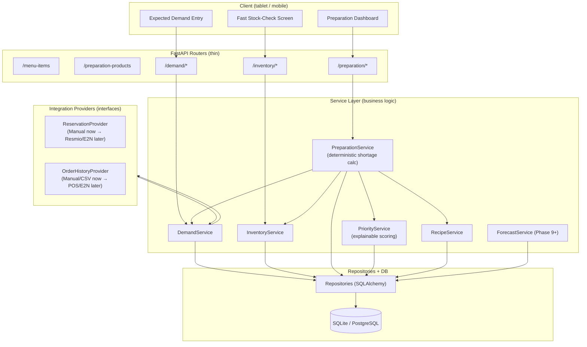

# Architecture — Restaurant Preparation Intelligence System

Phase 0 deliverable. Read alongside [data-model.md](data-model.md), [preparation-engine.md](preparation-engine.md), and [roadmap.md](roadmap.md).

## 0. Post-Review Corrections (2026-09-08)

The Phase 0 document set was reviewed and the architecture approved, subject to the following corrections applied throughout this document set before Phase 1 begins:

1. `service_period` (LUNCH/DINNER) is promoted from an assumption to a required field on `DemandForecast` and `PreparationTask`; `PreparationTask` uniqueness becomes `(preparation_product_id, service_date, service_period)`.
2. `PreparationProduct → PreparationRecipe` is one-to-many (multiple recipe versions, one active), not one-to-one.
3. The recipe-ingredient model is redesigned so a `PreparationRecipe` can eventually consume either a `RawIngredient` or another `PreparationProduct` (e.g. Sauce → Jus → raw ingredients), without implementing that consumption logic before Phase 7.
4. The priority algorithm's `shortage_score` is redefined to avoid division by zero for safety-stock-only tasks (`required_quantity = 0`).
5. "Current preparation stock" is redefined as the latest snapshot by `recorded_at` at or before a planning cutoff, not "latest row per day" — this is what allows morning stock → lunch usage → afternoon re-check → dinner planning.
6. Phase 1 seed-data guidance is corrected: only `seed_preparation_products.csv` comes from the handwritten kitchen sheets; menu items come from verified menu data; raw ingredients start empty/verified-only.
7. Persisted quantity columns move from `FLOAT` to `NUMERIC`/`DECIMAL` (rationale in §6 below).

A second review pass, after these corrections were applied, requested four further refinements:

8. `shortage_score` is simplified to a single formula — `target_quantity = required_quantity + safety_quantity`; `shortage_score = clamp(prepare_quantity / target_quantity, 0, 1)` if `target_quantity > 0` else `0` — replacing the two-branch (`required_quantity` / `safety_quantity`) version from correction 4. One denominator covers ordinary demand tasks, safety-stock-only tasks, and everything between.
9. Stock snapshots now carry an explicit freshness rule: a snapshot older than a configurable `MAX_STOCK_SNAPSHOT_AGE` (default 24h) is treated as unreliable, not as ground truth. `PreparationTask` gains `stock_status` (`KNOWN`/`UNKNOWN`) and `stock_recorded_at` so "available = 0 because we checked" is never confused with "available assumed 0 because we don't know" — see data-model.md §5 and preparation-engine.md §2.4.
10. `GET /inventory/preparation/current` is no longer unscoped; it now requires `service_date` + `service_period` and returns exactly the stock reading `PreparationService` would use for that planning run, so a dashboard querying it can never disagree with what a calculation actually saw.
11. `OrderHistory.quantity` moves from `FLOAT` to `NUMERIC`, closing a gap in correction 7 — it feeds the same forecasting/demand arithmetic pipeline (`DemandForecast.expected_quantity`, itself `NUMERIC`) and mixing `float`/`Decimal` across that boundary is exactly the class of bug correction 7 exists to prevent.

A new restaurant-domain requirement, surfaced after the second pass, added a further six items:

12. Four operational container units are added — `SMALL_BOX`, `MEDIUM_BOX`, `LARGE_BOX`, `XL_BOX` — joining the existing `OPAQUE` dimension in `core/units.py` alongside `portion`/`tray`/`container`, with full `Decimal` (fractional) support (`0.5 XL_BOX`).
13. **No universal box→weight table.** A new `PreparationProductContainerSize` table holds per-`PreparationProduct` conversions (`container_type` → `equivalent_quantity`/`equivalent_unit`), because the same box size represents a different physical quantity for different products (Krautsalat's `XL_BOX` ≠ Kartoffelsalat's `XL_BOX`). Recommended beyond the original sketch: `verified_by`/`verified_at`/`notes` columns, since every value must be manually verified and never guessed — see data-model.md §9.
14. `PreparationProduct.preferred_prep_unit` (nullable) records the kitchen's preferred display unit — a measurable unit or a container type — used to render (never store) calculated quantities; falls back to `default_unit` when unset or when its container's conversion isn't verified yet.
15. `demand_score` (§ preparation-engine.md 3.2) is corrected to use a new unitless `expected_usage_count` (sum of expected orders across menu items requiring the product) instead of raw `required_quantity` — this was a latent bug in the original Phase 0 design (comparing `kg` against `L` against `piece` across tasks was already dimensionally invalid before container units existed) that the container-unit work makes impossible to ignore. Container/display units and priority scoring are kept strictly separate: containers answer "how much to prepare," `expected_usage_count` answers "how in-demand is this product."
16. Container-unit conversion failures are handled asymmetrically by design: write-time (a stock snapshot or requirement recorded in an unverified container unit) is rejected immediately with a clear error, so bad data never reaches the calculation engine; read-time (dashboard display in an unverified `preferred_prep_unit`) degrades gracefully to the canonical unit rather than blocking the dashboard — see preparation-engine.md §2.5.
17. A future `PreparationBaseline` entity (weekday + service_period → typical quantity, often expressed in a container unit) is documented for **Phase 9** (data-model.md §10) — not implemented now; only its schema shape is anticipated so it doesn't require a retrofit later.

A fourth review pass added five more corrections:

18. **`urgency_score` is removed from the MVP priority algorithm.** It relied on a field (`earliest_expected_need`) that does not exist anywhere in the Phase 1–7 data model, and its definition ("vs. now") directly conflicts with the determinism principle this doc already established for stock freshness (§0 correction 9 / preparation-engine.md §2.4) — the same class of bug in a different sub-score. Weights are redistributed across the remaining five factors, not split evenly: `prep_time_score` absorbs most of the freed weight (it is the closest existing proxy for "this needs to start sooner"), `shortage_score` keeps a small top-up as the dominant signal. New defaults: `w1=0.40` (shortage), `w2=0.15` (demand), `w3=0.15` (dependency), `w4=0.20` (prep_time), `w5=0.10` (emergency difficulty) — see preparation-engine.md §3.2. Reintroduced once real order-time-of-day data exists (Phase 8+).
19. **The global `MAX_STOCK_SNAPSHOT_AGE`-only freshness rule (§0 correction 9) is superseded by service-aware stock-check windows.** A single age threshold generous enough to tolerate a once-a-day check (so a kitchen isn't flagged `UNKNOWN` at dinner every day) is, by the same generosity, unable to reject a morning snapshot for dinner planning even though lunch has since consumed from it — the threshold that solves one failure mode reintroduces the other. Each `service_period` now gets its own configured `[stock_check_window_start, planning_cutoff]`, and a snapshot is `KNOWN` for a service only if `recorded_at` falls inside *that service's* window; `DINNER`'s window is configured to open only after `LUNCH` service is expected to have ended. `MAX_STOCK_SNAPSHOT_AGE` is retained only as a secondary safeguard against a misconfigured, unrealistically wide window — see data-model.md §5 and preparation-engine.md §2.4.
20. The planned model/module `preparation_recipe_ingredient.py` is renamed to `preparation_recipe_component.py`, to match the `PreparationRecipeComponent` entity name it was left inconsistent with after correction 3.
21. The Demand API (preparation-engine.md §1) is corrected: `POST /demand/manual` must include `service_period` in its body, and `GET /demand` must require `service_period` alongside `service_date` — both were left as an oversight when `service_period` was introduced (correction 1) and would otherwise have allowed a `DemandForecast` write path that couldn't actually satisfy the required column.
22. `StorageLocation` gains `is_active`, matching the soft-delete rule already stated for every catalog entity (assumption 10) — it was missing from the original schema sketch with no documented reason for the exception. Phase 1 tests extend to cover its soft-delete behavior alongside the other three catalog entities.

No Phase 1 code has been written yet; this correction pass is documentation-only.

## 1. Business Problem (restated)

Traditional German scratch-cooking kitchens (reference: Das Humbser, Fürth) don't primarily struggle with raw-ingredient inventory. They struggle with a narrower, more urgent question, answered too late or too slowly:

> **Before service starts: what Step-2 preparation products (Bratkartoffeln, Kartoffelsalat, Jus, Spätzle, sauces, prepared proteins, dessert components, etc.) are missing, how much of each must be made, and in what order?**

Today this is solved by manual walk-throughs of freezers, fridges, Kühlhaus, and stations, written down by hand, with no systematic link back to expected demand or to preparation priority. Failure modes: forgotten components discovered mid-service, over-preparation/waste, and kitchen stress from unplanned emergency prep.

The system is a **decision-support tool**, not an inventory system. Inventory (current prepared stock) is only one input to the real output: a ranked, explainable "prepare this, this much, in this order" list.

## 2. Assumptions

These are working assumptions for Phase 0–6. They should be confirmed with the actual kitchen before Phase 1 starts, but are not blocking — all are easy to change later because the domain model already separates the concerns cleanly.

1. **Single restaurant, single location** for the MVP. No multi-tenant modeling yet (no `restaurant_id` on every table). Added later if a second location appears.
2. **Two services per day** (lunch/dinner) is enough granularity — this is now a firm design decision, not merely an assumption (see §0). `service_period` is a required enum (`LUNCH`, `DINNER`) on every planning entity that varies within a day; no need to model arbitrary time windows yet, and the enum can gain values (e.g. `BRUNCH`) later without a schema redesign.
3. **Single currency / no pricing concerns** — this system is about quantities and time, not cost, for the MVP.
4. **Users are kitchen staff with informal identity** — `recorded_by` / `completed_by` / `prepared_by` are free-text names or simple user IDs for MVP, not a full auth/RBAC system. A minimal user table with roles (kitchen staff vs. admin) is enough; no permission granularity yet.
5. **Manual demand entry is authoritative for MVP** — no POS/reservation feed. `DemandForecast.source = MANUAL` exclusively until Phase 8+.
6. **`PreparationProduct` → `PreparationRecipe` is one-to-many.** A product can accumulate multiple recipe versions over time (a recipe gets tweaked, portion sizes change, a supplier substitution changes yield); exactly one is `is_active` at a time, enforced in `RecipeService`, not in the schema shape. The MVP only ever reads the currently active recipe, but the relationship must never be modeled as one-to-one — see data-model.md §1/§4.
7. **Unit safety is a hard constraint, not a nicety** — see spec §9; the system must refuse cross-dimension conversions rather than guess.
8. **Deployment is single-machine / small-scale** — SQLite for dev, Postgres for prod, no need for message queues, caching layers, or microservices (spec §34).
9. **German and English are both first-class from day one** at the data level (`name_de` / `name_en` on every catalog entity) even though the UI may launch German-only — this avoids a painful migration later and costs almost nothing now.
10. **Soft delete everywhere for catalog entities** (`is_active` flag) — historical `PreparationTask` / `PreparationBatch` rows must remain valid even if a product is later deactivated.

## 3. Open / Unclear Points (need restaurant input before finalizing details)

These do not block Phase 1 architecture but should be tracked and revisited:

- **Safety stock definition**: is it a fixed quantity per product (as spec §6/§10 assumes) or a percentage of required demand? Spec assumes fixed quantity (`PreparationProduct.safety_stock`) — going with that for MVP, configurable later.
- **Multiple prep sessions per day** — resolved by §0 corrections #5 and #19: `PreparationStock` snapshots are timestamped (`recorded_at`), and "current stock" for a given `(service_date, service_period)` is the latest snapshot inside *that service's own configured window* (`[stock_check_window_start, planning_cutoff]`), not "the day's row" and not merely "before the cutoff." This supports morning stock → lunch usage → afternoon re-check → dinner planning without new tables, and correctly reports `UNKNOWN` for dinner when no afternoon re-check happened. Full selection semantics are in preparation-engine.md §2.4.
- **Who enters expected demand?** Chef, manager, or reception (from reservations)? Affects UI role design later, not the MVP data model.
- **Shelf life enforcement**: `shelf_life_hours` exists on `PreparationProduct`, but should expired stock auto-zero itself, or only warn? Assumption: **warn only** for MVP; no automatic quantity mutation (AI/automation must not silently change quantities per spec §35).
- **Unit of "portion"/"piece"** is product-specific and not convertible to weight without a recipe-level conversion — treated as an opaque unit per spec §9, no implicit math across it.
- **Priority weight defaults** (`w1..w5` — reduced from `w1..w6` by §0 correction #18, which removes `urgency_score` for MVP): need at least one real kitchen walkthrough to sanity-check; ship with reasonable defaults and make them config, not hardcoded.

## 4. MVP Architecture

**Style: modular monolith**, per spec §24/§34 — no microservices, one deployable backend.

```text
Client (tablet/mobile browser)
        │
        ▼
FastAPI app (single process)
   ├── api/            thin routers — request/response only
   ├── schemas/        Pydantic request/response models
   ├── services/        business logic (deterministic calculations live here)
   ├── repositories/    SQLAlchemy data access, isolated from services
   ├── integrations/    provider interfaces (Manual/CSV now, POS/E2N/Resmio later)
   ├── models/           SQLAlchemy ORM models
   └── db/               engine/session/Alembic
        │
        ▼
SQLite (dev) / PostgreSQL (prod)
```

Key architectural rules (from spec §34/§35, made concrete):

- **Routes never contain business logic.** A route calls exactly one service method and maps the result to a schema.
- **Services never touch SQLAlchemy sessions directly for cross-cutting logic** — they call repositories. This keeps `PreparationService` / `PriorityService` unit-testable without a database.
- **All arithmetic (shortage, prepare quantity, priority score) is deterministic and unit-tested.** No LLM call is ever in the path of a quantity calculation (spec §35).
- **Integrations are interfaces first.** `ReservationProvider` / `OrderHistoryProvider` are ABCs; `ManualReservationProvider` is the only Phase-1..7 implementation. This is what lets Phase 12 (E2N/POS/Resmio) plug in without touching the preparation engine.
- **Voice (Phase 11) is additive**: Speech-to-Text → Intent Extraction → Pydantic validation → the *same* service methods the REST API uses. Voice never bypasses validation or calls arithmetic directly.

### 4.1 Component / Data-Flow Diagram



## 5. Backend Folder Structure (proposal)

Matches spec §25, made concrete for Phase 1 scope (files marked `(P1)` are created in Phase 1; others are stubs/added later — no empty scaffolding for far-future phases yet, per "don't build everything at once").

```text
restaurant-prep-system/
├── README.md
├── PROJECT_SPEC_RESTAURANT_PREP.md
├── .env.example
├── .gitignore
│
├── backend/
│   ├── app/
│   │   ├── main.py                          (P1)
│   │   │
│   │   ├── api/
│   │   │   ├── menu_items.py                (P1)
│   │   │   ├── preparation_products.py      (P1)
│   │   │   ├── raw_ingredients.py           (P1)
│   │   │   ├── storage_locations.py         (P1)
│   │   │   ├── inventory.py                 (P2)
│   │   │   ├── demand.py                    (P3)
│   │   │   ├── preparation.py               (P4/P5/P6)
│   │   │   ├── forecasts.py                 (P9, stub later)
│   │   │   └── voice.py                     (P11, stub later)
│   │   │
│   │   ├── models/
│   │   │   ├── base.py                      (P1)
│   │   │   ├── menu_item.py                 (P1)
│   │   │   ├── preparation_product.py       (P1)
│   │   │   ├── raw_ingredient.py            (P1)
│   │   │   ├── storage_location.py          (P1)
│   │   │   ├── menu_item_preparation_requirement.py (P1)
│   │   │   ├── preparation_product_container_size.py (P1 — schema only; left empty until verified, see data-model.md §9)
│   │   │   ├── preparation_stock.py         (P2)
│   │   │   ├── raw_ingredient_stock.py      (P7)
│   │   │   ├── demand_forecast.py           (P3)
│   │   │   ├── preparation_task.py          (P4)
│   │   │   ├── preparation_batch.py         (P6)
│   │   │   ├── preparation_recipe.py        (P7)
│   │   │   ├── preparation_recipe_component.py (P7 — matches PreparationRecipeComponent, data-model.md §6)
│   │   │   ├── reservation.py               (P10)
│   │   │   ├── order_history.py             (P8)
│   │   │   └── waste_record.py              (P13)
│   │   │
│   │   ├── schemas/                         (mirrors models, Pydantic v2)
│   │   │
│   │   ├── repositories/                    (one per aggregate root; P1 for catalog entities)
│   │   │
│   │   ├── services/
│   │   │   ├── inventory_service.py         (P2)
│   │   │   ├── demand_service.py            (P3)
│   │   │   ├── recipe_service.py            (P7)
│   │   │   ├── container_conversion_service.py (P4 — convert_for_product, write-time validation; P6 adds display use — preparation-engine.md §2.5)
│   │   │   ├── preparation_service.py       (P4)
│   │   │   ├── priority_service.py          (P5)
│   │   │   ├── forecast_service.py          (P9)
│   │   │   ├── reservation_service.py       (P10)
│   │   │   ├── order_history_service.py     (P8)
│   │   │   └── voice_command_service.py     (P11)
│   │   │
│   │   ├── integrations/
│   │   │   ├── base.py                      (interfaces: ReservationProvider, OrderHistoryProvider — sketch in P1, implement later)
│   │   │   ├── manual_provider.py           (P3)
│   │   │   ├── csv_provider.py              (P8/P10)
│   │   │   ├── e2n_provider.py              (P12, not built yet)
│   │   │   └── resmio_provider.py           (P12, not built yet)
│   │   │
│   │   ├── voice/                           (P11, not built yet)
│   │   ├── forecasting/                     (P9, not built yet)
│   │   │
│   │   ├── core/
│   │   │   ├── config.py                    (P1; gains per-service stock-check windows — LUNCH/DINNER stock_check_window_start + planning_cutoff — and the secondary MAX_STOCK_SNAPSHOT_AGE safeguard when Phase 4 needs them)
│   │   │   ├── units.py                     (P1 — unit + conversion safety, spec §9; Decimal-based, see §6; container units in the OPAQUE dimension, data-model.md §9)
│   │   │   └── enums.py                     (P1 — PreparationStatus, PriorityLevel, DemandSource, Unit, ServicePeriod, StockStatus)
│   │   │
│   │   └── db/
│   │       ├── session.py                   (P1)
│   │       └── base.py                      (P1)
│   │
│   ├── tests/
│   │   ├── unit/
│   │   │   ├── test_units.py
│   │   │   ├── test_preparation_service.py
│   │   │   └── test_priority_service.py
│   │   └── integration/
│   │
│   ├── requirements.txt
│   └── alembic/
│
├── frontend/                                 (deferred until Phase 2 UI; HTMX/Jinja2 for MVP simplicity per spec §24)
│
├── data/
│   ├── seed_menu_items.csv
│   ├── seed_preparation_products.csv
│   └── seed_raw_ingredients.csv
│
├── docs/
│   ├── architecture.md        ← this file
│   ├── data-model.md
│   ├── preparation-engine.md
│   └── roadmap.md
│
└── scripts/
```

Frontend choice for MVP: **FastAPI + Jinja2 + HTMX + Tailwind**, not React/Next.js, per spec §24's explicit preference for simplicity in v1. This is also better suited to the "large buttons, minimal typing, fast quantity entry" tablet UI requirement (spec §31) without a build pipeline. React/Next.js can be revisited once the dashboard's interactivity needs (e.g., live recalculation, drag-priority-override) outgrow HTMX — not before.

## 6. Numeric Type Decision: `NUMERIC`/`DECIMAL` over `FLOAT` for Persisted Quantities

**Decision: all persisted physical-quantity columns use SQL `NUMERIC` (SQLAlchemy `Numeric`, Python `decimal.Decimal`), not `FLOAT`/`REAL`.** This applies to every quantity that is stored, converted between units, or compared against a threshold: `PreparationProduct.minimum_stock/target_stock/safety_stock`, `MenuItemPreparationRequirement.quantity_per_portion`, `PreparationRecipe.yield_quantity`, `PreparationRecipeComponent.quantity`, `PreparationStock.quantity`, `RawIngredientStock.quantity`, `DemandForecast.expected_quantity/confidence_low/confidence_high`, `PreparationTask.required_quantity/available_quantity/safety_quantity/prepare_quantity/recommended_quantity/final_quantity`, `PreparationBatch.quantity`, `WasteRecord.quantity`, and (per correction 11, §0) `OrderHistory.quantity` — it is a Phase 8 input into the same forecast → `DemandForecast.expected_quantity` → `PreparationService` arithmetic chain, and there was no reason for it to be the one `float` in that chain.

**Why not `FLOAT`:**

- `FLOAT` is IEEE-754 binary floating point; it cannot represent most decimal fractions exactly (`0.1 + 0.2 != 0.3`). Kitchen quantities are entered and read as decimal numbers (`2.5 kg`, `0.2 L`), so binary float introduces representation error from the first write.
- The preparation engine does **repeated unit conversions** (kg↔g, L↔ml) and **repeated summation** across menu items sharing a preparation product (spec §10). Binary float error compounds with each operation.
- The engine makes **hard threshold comparisons** that must be exact, not "close enough": `prepare_quantity <= 0` decides whether a task is created at all (spec §10); a float-drifted `prepare_quantity` of `-1e-13` instead of exactly `0` is cosmetically harmless here (still `<= 0`), but the *reverse* drift (a true `0` computed as `4e-14`) would wrongly create a phantom prepare task. Deterministic, reproducible calculation is a stated hard requirement (spec §29, §35) — "reproducible" should not be qualified by floating-point rounding mode.
- Decimal also matches how the business already thinks about quantities (fixed decimal precision on a kitchen scale — grams, not femtograms), so `NUMERIC(10,3)` (three decimal places, ample headroom below a metric tonne) is a natural fit, not an arbitrary constraint.

**What stays `FLOAT`:** `priority_score` and its sub-scores (`shortage_score`, `demand_score`, etc.), `PreparationProduct.difficulty_score`. These are normalized `[0, 1]` computed scores, not persisted physical quantities — they are never unit-converted, never summed across rows, and their threshold comparisons (`>= 0.75`) tolerate ordinary floating-point precision. Using `Decimal` here would add friction (weight math, percentile normalization) for no correctness benefit.

**Implementation consequence for `core/units.py`:** `convert()` and all arithmetic in `PreparationService` operate on `Decimal`, not `float`. Values are quantized to the column's scale (3 decimal places for MASS/VOLUME canonical units) at the point they're persisted, using `ROUND_HALF_UP`, so repeated round-trips are stable. Pydantic schemas use `condecimal(ge=0, decimal_places=3)` (or equivalent v2 constraint) for quantity fields rather than `confloat`.
