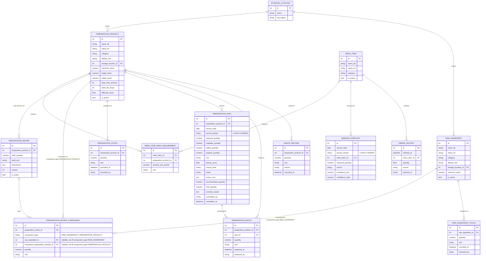

# Data Model — Restaurant Preparation Intelligence System

Phase 0 deliverable. Scope: entities needed through Phase 7 (spec §8), with Phase number annotated. Full field lists follow spec §8; deviations/clarifications are called out.

## 1. Entity-Relationship Diagram



*(`RESERVATION` is Phase 10 and intentionally omitted here — it has no FK relationship into the Phase 1–7 core model; it only feeds `DemandForecast` indirectly via `ReservationService`.)*

## 2. Phase Mapping

| Entity | Introduced | Notes |
|---|---|---|
| StorageLocation | Phase 1 | seed with freezer / Kühlhaus / dry storage / stations |
| MenuItem | Phase 1 | seed from the verified restaurant menu, **not** the handwritten prep sheets — see §7 |
| PreparationProduct | Phase 1 | seed from the handwritten kitchen sheets (Step-2 preparation products) — see §7 |
| RawIngredient | Phase 1 | table exists, unused by engine until Phase 7; seed empty or verified-only — see §7 |
| MenuItemPreparationRequirement | Phase 1 | the join that drives all downstream calculation |
| PreparationStock | Phase 2 | one row per snapshot; "current stock" = the latest snapshot by `recorded_at` at or before the relevant planning cutoff, **not** simply the latest row for the calendar day — see §5 and preparation-engine.md |
| DemandForecast | Phase 3 | `source='MANUAL'` only until Phase 8+; now carries `service_period` (§4) |
| PreparationTask | Phase 4 (create/calc) → Phase 5 (priority fields) → Phase 6 (status/override fields) | one row per `(preparation_product_id, service_date, service_period)` — see §4 |
| PreparationBatch | Phase 6 | actual quantity prepared, linked to the task it closes |
| PreparationRecipe / PreparationRecipeComponent | Phase 7 | enables "can we prepare this?"; `PreparationRecipe` is one-to-many from `PreparationProduct` (§6); `PreparationRecipeComponent` can reference a `RawIngredient` or another `PreparationProduct` (§6) |
| RawIngredientStock | Phase 7 | |
| OrderHistory | Phase 8 | |
| Reservation | Phase 10 | |
| WasteRecord | Phase 13 | |

## 3. Units (spec §9) — implementation note

`core/units.py` defines:

```text
Dimension: MASS | VOLUME | COUNT | OPAQUE
Unit → Dimension mapping:
    kg, g            → MASS      (canonical: g)
    L, ml            → VOLUME    (canonical: ml)
    piece            → COUNT
    portion, tray, container → OPAQUE (product-specific, no cross-conversion)

convert(quantity: Decimal, from_unit, to_unit) -> Decimal:
    raise IncompatibleUnitError unless from_unit.dimension == to_unit.dimension
```

All quantity arithmetic in `PreparationService` normalizes to the canonical unit for the product's dimension before summing, then converts back to `default_unit` for display. `portion`/`piece`/`tray`/`container` never get summed against `kg`/`L` implicitly — only via an explicit recipe-level yield conversion (spec §9), which is out of scope until Phase 7. Arithmetic is done in `decimal.Decimal`, not `float` — see architecture.md §6 for why, and the "numeric" field types on every quantity column above.

## 4. Service Period

`ServicePeriod` is a required enum, defined in `core/enums.py` alongside the other Phase 1 enums:

```text
ServicePeriod: LUNCH | DINNER
```

It is a required (non-nullable) column on `DemandForecast` and `PreparationTask` — not optional, and not defaulted to `DINNER` in the schema (a caller must say which service a forecast or task belongs to). `PreparationTask` uniqueness is:

```text
UNIQUE (preparation_product_id, service_date, service_period)
```

replacing the earlier `(preparation_product_id, service_date)` constraint — a kitchen that preps separately for lunch and dinner needs two independent tasks (and two independent shortage calculations) for the same product on the same day. `PreparationService.calculate()` and `GET /preparation/today` both take `service_period` as a required input; see preparation-engine.md §1–2. The enum is intentionally extensible (e.g. a future `BRUNCH`) without a schema migration beyond adding the enum value.

## 5. Current Stock Selection Semantics

"Current preparation stock" for a `(service_date, service_period)` planning run is **not** "the latest `PreparationStock` row recorded that calendar day." It is the latest row by `recorded_at` at or before that service period's planning cutoff. This is what allows the intra-day sequence the kitchen actually follows:

```text
morning stock snapshot
        → lunch service consumes stock
                → afternoon stock re-check snapshot
                        → dinner planning uses the afternoon snapshot, not the morning one
```

If dinner planning ran off "the day's latest row" *before* the afternoon re-check was recorded, it would use a stale morning number; if it ran off "the day's latest row" *unconditionally*, a re-check recorded mid-dinner-service would corrupt the dinner plan retroactively. Selecting by `recorded_at <= cutoff(service_date, service_period)` avoids both failure modes. Full selection algorithm, including the fallback when no snapshot exists in the window, is in preparation-engine.md §2.

This is also why `PreparationStock.recorded_at` is a `datetime`, not a `date` — the date alone cannot distinguish the morning snapshot from the afternoon one.

## 6. Recipe Composability — Phase 7 Design (`PreparationRecipeComponent`)

**Not implemented in Phase 1.** This section exists so the Phase 1–6 schema does not need a breaking migration when Phase 7 (raw ingredient layer) is built.

**Cardinality correction:** `PreparationProduct → PreparationRecipe` is **one-to-many**, not one-to-one (§1 ER diagram, architecture.md §0/assumption 6). A product accumulates recipe versions over time; `PreparationRecipe.is_active` (with `RecipeService`-enforced "at most one active per product") is what the engine actually reads, not a schema-level singleton.

**The composability requirement:** eventually a `PreparationRecipe` must be able to consume either a `RawIngredient` or another `PreparationProduct` as a component — e.g. a Sauce recipe consumes Jus (a `PreparationProduct`), and Jus's own recipe consumes raw ingredients (stock, bones, vegetables). A plain single-FK "ingredient" row (`raw_ingredient_id` only, as in the original spec §8 sketch) permanently precludes this. The fix, reflected in the ER diagram (§1):

```text
PreparationRecipeComponent
    id
    preparation_recipe_id        FK -> PreparationRecipe
    component_type                ENUM(RAW_INGREDIENT, PREPARATION_PRODUCT)
    raw_ingredient_id             FK -> RawIngredient, nullable
    component_preparation_product_id  FK -> PreparationProduct, nullable
    quantity                      NUMERIC
    unit                          string
```

with a DB `CHECK` constraint enforcing exactly one FK is populated, matching `component_type`:

```sql
CHECK (
    (component_type = 'RAW_INGREDIENT'
        AND raw_ingredient_id IS NOT NULL
        AND component_preparation_product_id IS NULL)
 OR (component_type = 'PREPARATION_PRODUCT'
        AND component_preparation_product_id IS NOT NULL
        AND raw_ingredient_id IS NULL)
)
```

This is the standard "typed nullable-FK pair" pattern for a small, closed set of polymorphic targets — preferred here over a single generic `(component_table, component_id)` pair because it keeps real foreign-key integrity (the DB enforces both referenced rows exist) rather than relying on application code alone.

**Cycle prevention (Phase 7 concern, not Phase 1):** because a `PreparationProduct` can now appear as a component of another `PreparationProduct`'s recipe, the dependency graph must stay a DAG (Sauce → Jus is fine; Jus → Sauce, or Jus → Jus, is not). `RecipeService`, when Phase 7 adds a `PREPARATION_PRODUCT`-typed component, must run a graph traversal (DFS from the new component back toward the owning recipe's product) and reject the write if it would introduce a cycle. This is application-level validation, not a constraint the schema itself can express — flagged here so it isn't forgotten when Phase 7 is implemented.

**"Can we prepare this?" resolution (Phase 7):** with this shape, resolving raw-ingredient availability for a top-level preparation product becomes a recursive walk — for each `PreparationRecipeComponent`, if `component_type = RAW_INGREDIENT` check `RawIngredientStock` directly; if `component_type = PREPARATION_PRODUCT`, recurse into that product's active recipe (or treat it as its own shortage/prepare-quantity check against `PreparationStock`, per the chef's choice of whether an intermediate product must be pre-made or can be made on demand). This recursive resolution is explicitly **out of scope for Phase 1–6**; only the schema needs to support it now.

## 7. Seed Data Sourcing (Phase 1 correction)

The handwritten kitchen sheets supplied for this project are **Step-2 preparation products only** (spec §1/§33). They populate `data/seed_preparation_products.csv` and nothing else:

- `data/seed_preparation_products.csv` — transcribed from the handwritten sheets.
- `data/seed_menu_items.csv` — sourced from the restaurant's actual menu / manually verified menu data (e.g. https://www.dashumbser.de/karte), **never** inferred from the prep sheets.
- `data/seed_raw_ingredients.csv` — starts **empty**, or containing only explicitly verified raw ingredients if any are already known with confidence. Raw ingredients must **not** be inferred/guessed from the handwritten preparation sheets. This file is expected to be expanded in Phase 7, once `PreparationRecipe`/`PreparationRecipeComponent` rows are documented and each recipe's actual raw-ingredient components are known.

See roadmap.md Phase 1 task breakdown for the corresponding task-list wording.

## 8. Data Integrity Rules (spec §29, made concrete)

- `quantity >= 0` — enforced at the Pydantic schema level (`Field(ge=0)`) *and* a DB `CHECK` constraint, since services are the only write path but defense-in-depth is cheap.
- Uniqueness: `(name_de)` and `(name_en)` unique per catalog table (`MenuItem`, `PreparationProduct`, `RawIngredient`) among active rows — soft-deleted rows may keep a stale name without blocking a new active one.
- Uniqueness: `PreparationTask (preparation_product_id, service_date, service_period)` — see §4.
- `PreparationTask` is immutable once `status = COMPLETED`, except through the explicit override fields (which are themselves logged, not silent edits).
- `PreparationRecipe.is_active`: at most one active recipe per `preparation_product_id`, enforced in `RecipeService`, not just convention. The relationship itself is one-to-many (§6) — this rule constrains *which* row is active, it does not collapse the relationship to one-to-one.
- `PreparationRecipeComponent`: `CHECK` constraint enforcing exactly one of `raw_ingredient_id` / `component_preparation_product_id` is set, matching `component_type` (§6). Cycle-freedom across `PREPARATION_PRODUCT`-typed components is enforced in `RecipeService`, not the schema (§6).
- Foreign keys are `ON DELETE RESTRICT` for catalog references from historical tables (`PreparationTask`, `PreparationBatch`, `PreparationStock`) — history must never silently cascade-delete. Catalog entities are soft-deleted (`is_active=False`), never hard-deleted, for anything with historical references.
