# Data Model — Restaurant Preparation Intelligence System

Phase 0 deliverable. Scope: entities needed through Phase 7 (spec §8), with Phase number annotated. Full field lists follow spec §8; deviations/clarifications are called out.

## 1. Entity-Relationship Diagram

```mermaid
erDiagram
    STORAGE_LOCATION ||--o{ PREPARATION_PRODUCT : stores
    STORAGE_LOCATION ||--o{ RAW_INGREDIENT : stores

    MENU_ITEM ||--o{ MENU_ITEM_PREP_REQUIREMENT : requires
    PREPARATION_PRODUCT ||--o{ MENU_ITEM_PREP_REQUIREMENT : "used by"

    PREPARATION_PRODUCT ||--o{ PREPARATION_RECIPE : "has versions of"
    PREPARATION_RECIPE ||--o{ PREPARATION_RECIPE_COMPONENT : uses
    RAW_INGREDIENT ||--o{ PREPARATION_RECIPE_COMPONENT : "consumed as (component_type=RAW_INGREDIENT)"
    PREPARATION_PRODUCT ||--o{ PREPARATION_RECIPE_COMPONENT : "consumed as (component_type=PREPARATION_PRODUCT)"

    PREPARATION_PRODUCT ||--o{ PREPARATION_STOCK : "snapshot of"
    RAW_INGREDIENT ||--o{ RAW_INGREDIENT_STOCK : "snapshot of"

    PREPARATION_PRODUCT ||--o{ PREPARATION_PRODUCT_CONTAINER_SIZE : "has container conversions"

    MENU_ITEM ||--o{ DEMAND_FORECAST : "forecast for"

    PREPARATION_PRODUCT ||--o{ PREPARATION_TASK : "task for"
    PREPARATION_TASK ||--o{ PREPARATION_BATCH : "produced by"
    PREPARATION_PRODUCT ||--o{ PREPARATION_BATCH : "batch of"
    PREPARATION_PRODUCT ||--o{ WASTE_RECORD : "waste of"

    MENU_ITEM ||--o{ ORDER_HISTORY : ordered

    MENU_ITEM {
        int id PK
        string name_de
        string name_en
        string category
        bool is_active
    }

    PREPARATION_PRODUCT {
        int id PK
        string name_de
        string name_en
        string category
        string default_unit
        int storage_location_id FK
        numeric minimum_stock
        numeric target_stock
        numeric safety_stock
        int prep_time_minutes
        int shelf_life_hours
        float difficulty_score
        string preferred_prep_unit "nullable; kg|L|piece|portion|SMALL_BOX|MEDIUM_BOX|LARGE_BOX|XL_BOX; falls back to default_unit"
        bool is_active
    }

    PREPARATION_PRODUCT_CONTAINER_SIZE {
        int id PK
        int preparation_product_id FK
        string container_type "SMALL_BOX | MEDIUM_BOX | LARGE_BOX | XL_BOX"
        numeric equivalent_quantity
        string equivalent_unit "must be a non-container unit in the product's own dimension"
        bool is_active
        string verified_by
        datetime verified_at
        text notes
    }

    RAW_INGREDIENT {
        int id PK
        string name_de
        string name_en
        string category
        string default_unit
        int storage_location_id FK
        numeric minimum_stock
        bool is_active
    }

    MENU_ITEM_PREP_REQUIREMENT {
        int id PK
        int menu_item_id FK
        int preparation_product_id FK
        numeric quantity_per_portion
        string unit
    }

    PREPARATION_RECIPE {
        int id PK
        int preparation_product_id FK
        numeric yield_quantity
        string yield_unit
        text instructions
        int version
        bool is_active
    }

    PREPARATION_RECIPE_COMPONENT {
        int id PK
        int preparation_recipe_id FK
        string component_type "RAW_INGREDIENT | PREPARATION_PRODUCT"
        int raw_ingredient_id FK "nullable, set iff component_type=RAW_INGREDIENT"
        int component_preparation_product_id FK "nullable, set iff component_type=PREPARATION_PRODUCT"
        numeric quantity
        string unit
    }

    PREPARATION_STOCK {
        int id PK
        int preparation_product_id FK
        numeric quantity
        string unit
        datetime recorded_at
        string recorded_by
    }

    RAW_INGREDIENT_STOCK {
        int id PK
        int raw_ingredient_id FK
        numeric quantity
        string unit
        datetime recorded_at
        string recorded_by
    }

    DEMAND_FORECAST {
        int id PK
        date service_date
        string service_period "LUNCH | DINNER"
        int menu_item_id FK
        numeric expected_quantity
        string source
        numeric confidence_low
        numeric confidence_high
    }

    PREPARATION_TASK {
        int id PK
        int preparation_product_id FK
        date service_date
        string service_period "LUNCH | DINNER"
        numeric required_quantity
        numeric available_quantity
        numeric safety_quantity
        numeric prepare_quantity
        string unit
        string stock_status "KNOWN | UNKNOWN"
        datetime stock_recorded_at "nullable; recorded_at of the snapshot used (fresh or stale), null iff never checked"
        float priority_score
        string priority_level
        string status
        text reason_text
        numeric recommended_quantity
        numeric final_quantity
        text override_reason
        string overridden_by
        datetime overridden_at
    }

    PREPARATION_BATCH {
        int id PK
        int preparation_product_id FK
        int task_id FK
        numeric quantity
        string unit
        datetime prepared_at
        string prepared_by
    }

    WASTE_RECORD {
        int id PK
        int preparation_product_id FK
        numeric quantity
        string unit
        string reason
        datetime recorded_at
    }

    STORAGE_LOCATION {
        int id PK
        string name
        string description
        bool is_active
    }

    ORDER_HISTORY {
        int id PK
        datetime ordered_at
        int menu_item_id FK
        numeric quantity
        string source
        string external_id
    }
```



*(`RESERVATION` is Phase 10 and intentionally omitted here — it has no FK relationship into the Phase 1–7 core model; it only feeds `DemandForecast` indirectly via `ReservationService`.)*

## 2. Phase Mapping

| Entity | Introduced | Notes |
|---|---|---|
| StorageLocation | Phase 1 | seed with freezer / Kühlhaus / dry storage / stations |
| MenuItem | Phase 1 | seed from the verified restaurant menu, **not** the handwritten prep sheets — see §7 |
| PreparationProduct | Phase 1 | seed from the handwritten kitchen sheets (Step-2 preparation products) — see §7 |
| RawIngredient | Phase 1 | table exists, unused by engine until Phase 7; seed empty or verified-only — see §7 |
| MenuItemPreparationRequirement | Phase 1 | the join that drives all downstream calculation |
| PreparationProductContainerSize | Phase 1 (schema) → Phase 4 (calc-time conversion) → Phase 6 (dashboard display) | product-specific box-size conversions; schema created early, but left **empty** until the restaurant verifies each value — see §9 |
| PreparationStock | Phase 2 | one row per snapshot; "current stock" = the latest snapshot *inside the requesting service period's own stock-check window*, **not** simply the latest row for the calendar day, and **not** any row from outside that window — see §5 and preparation-engine.md §2.4 |
| DemandForecast | Phase 3 | `source='MANUAL'` only until Phase 8+; now carries `service_period` (§4) |
| PreparationTask | Phase 4 (create/calc) → Phase 5 (priority fields) → Phase 6 (status/override fields) | one row per `(preparation_product_id, service_date, service_period)` — see §4; carries `stock_status`/`stock_recorded_at` from Phase 4 onward — see §5 |
| PreparationBatch | Phase 6 | actual quantity prepared, linked to the task it closes |
| PreparationRecipe / PreparationRecipeComponent | Phase 7 | enables "can we prepare this?"; `PreparationRecipe` is one-to-many from `PreparationProduct` (§6); `PreparationRecipeComponent` can reference a `RawIngredient` or another `PreparationProduct` (§6) |
| RawIngredientStock | Phase 7 | |
| OrderHistory | Phase 8 | |
| Reservation | Phase 10 | |
| WasteRecord | Phase 13 | |
| PreparationBaseline | Phase 9 | weekday/service-period typical-quantity reference, often expressed in container units — see §10 |

## 3. Units (spec §9) — implementation note

`core/units.py` defines:

```text
Dimension: MASS | VOLUME | COUNT | OPAQUE
Unit → Dimension mapping:
    kg, g            → MASS      (canonical: g)
    L, ml            → VOLUME    (canonical: ml)
    piece            → COUNT
    portion, tray, container,
    SMALL_BOX, MEDIUM_BOX,
    LARGE_BOX, XL_BOX → OPAQUE (product-specific, no cross-conversion — see §9)

convert(quantity: Decimal, from_unit, to_unit) -> Decimal:
    raise IncompatibleUnitError unless from_unit.dimension == to_unit.dimension
```

All quantity arithmetic in `PreparationService` normalizes to the canonical unit for the product's dimension before summing, then converts back to `default_unit` for display. `portion`/`piece`/`tray`/`container` never get summed against `kg`/`L` implicitly — only via an explicit recipe-level yield conversion (spec §9), which is out of scope until Phase 7. Arithmetic is done in `decimal.Decimal`, not `float` — see architecture.md §6 for why, and the "numeric" field types on every quantity column above.

## 4. Service Period

`ServicePeriod` is a required enum, defined in `core/enums.py` alongside the other Phase 1 enums:

```text
ServicePeriod: LUNCH | DINNER
```

It is a required (non-nullable) column on `DemandForecast` and `PreparationTask` — not optional, and not defaulted to `DINNER` in the schema (a caller must say which service a forecast or task belongs to). `PreparationTask` uniqueness is:

```text
UNIQUE (preparation_product_id, service_date, service_period)
```

replacing the earlier `(preparation_product_id, service_date)` constraint — a kitchen that preps separately for lunch and dinner needs two independent tasks (and two independent shortage calculations) for the same product on the same day. `PreparationService.calculate()` and `GET /preparation/today` both take `service_period` as a required input; see preparation-engine.md §1–2. The enum is intentionally extensible (e.g. a future `BRUNCH`) without a schema migration beyond adding the enum value.

## 5. Current Stock Selection Semantics — Service-Aware Stock-Check Windows

"Current preparation stock" for a `(service_date, service_period)` planning run is **not** "the latest `PreparationStock` row recorded that calendar day," and it is **not** whatever the latest snapshot says regardless of how old it is. Each service period has its **own configured stock-check window**, and a snapshot only counts for that service if it falls inside that window:

```text
stock_check_window_start(service_period) <= recorded_at <= planning_cutoff(service_period)
```

```text
morning stock snapshot
        → lunch service consumes stock
                → afternoon stock re-check snapshot
                        → dinner planning uses the afternoon snapshot, not the morning one
```

**Why a single global "freshness age" cannot express this rule, and a per-service window can.** A morning snapshot (e.g. `07:00`) is not old in absolute terms by the time dinner is planned (e.g. `17:30`) — a flat age threshold generous enough to tolerate a kitchen that only checks stock once in the morning (so it isn't flagged `UNKNOWN` every single dinner) is, by the same generosity, unable to reject that same morning snapshot for dinner planning, even though lunch service has since consumed from it. The fix is not a shorter global threshold (which just breaks the once-a-day kitchen instead) — it is giving each service period its **own window**, configured so `DINNER`'s window only opens *after* `LUNCH` service is expected to have ended:

```text
Example configuration (restaurant-specific, core/config.py):
    LUNCH:  stock_check_window_start = 05:00, planning_cutoff = 11:30
    DINNER: stock_check_window_start = 14:00, planning_cutoff = 17:30
```

A `07:00` snapshot falls inside `LUNCH`'s window but outside `DINNER`'s — so it is usable for lunch and, correctly, **not** usable for dinner without a genuine re-check recorded at or after `14:00`. This is the mechanism, not a side effect of it: `LUNCH` and `DINNER` never compare against "the day's latest row," each resolves strictly from its own window.

**Stock is resolved to one of two states, never silently collapsed into a single number:**

- **`KNOWN`** — a `PreparationStock` row exists inside this service's `[window_start, planning_cutoff]`. `PreparationTask.available_quantity` reflects that row's quantity.
- **`UNKNOWN`** — no `PreparationStock` row falls inside this service's window (whether because none exists at all, or because the only one available is outside the window — e.g. a morning-only snapshot for a `DINNER` calculation). `PreparationTask.available_quantity` is forced to `0` for arithmetic purposes only (the conservative, over-prepare-rather-than-under-prepare direction), but this is never presented to a user as a confirmed stock check.

`MAX_STOCK_SNAPSHOT_AGE` (a single configurable duration) is **retained only as a secondary safeguard** — with windows configured to a realistic width (a few hours), anything inside a window is already recent by construction, so this check is expected to rarely trigger; it exists purely to catch a misconfigured, unrealistically wide window, not as the primary staleness rule. The window is the primary rule.

This is the explicit distinction between **`AVAILABLE = 0`** (a fresh, in-window snapshot that genuinely reads zero — `stock_status = KNOWN`, `available_quantity = 0`) and **`STOCK UNKNOWN` / not checked for this service** (`stock_status = UNKNOWN`, `available_quantity` forced to `0` only as a calculation placeholder). `PreparationTask.stock_status` and `PreparationTask.stock_recorded_at` (nullable — `NULL` only when no snapshot exists at all before the cutoff; populated with the out-of-window snapshot's timestamp otherwise, so "last checked this morning" is distinguishable from "never checked") carry this distinction through to the dashboard and `reason_text`, so "we checked, there's none" and "we don't know" never look the same to a kitchen worker. Full selection algorithm — including why window boundaries, not wall-clock time, decide freshness, to keep `PreparationService.calculate()` reproducible — is in preparation-engine.md §2.4.

This is also why `PreparationStock.recorded_at` is a `datetime`, not a `date` — the date alone cannot distinguish the morning snapshot from the afternoon one, nor tell a fresh snapshot from a stale one.

## 6. Recipe Composability — Phase 7 Design (`PreparationRecipeComponent`)

**Not implemented in Phase 1.** This section exists so the Phase 1–6 schema does not need a breaking migration when Phase 7 (raw ingredient layer) is built.

**Cardinality correction:** `PreparationProduct → PreparationRecipe` is **one-to-many**, not one-to-one (§1 ER diagram, architecture.md §0/assumption 6). A product accumulates recipe versions over time; `PreparationRecipe.is_active` (with `RecipeService`-enforced "at most one active per product") is what the engine actually reads, not a schema-level singleton.

**The composability requirement:** eventually a `PreparationRecipe` must be able to consume either a `RawIngredient` or another `PreparationProduct` as a component — e.g. a Sauce recipe consumes Jus (a `PreparationProduct`), and Jus's own recipe consumes raw ingredients (stock, bones, vegetables). A plain single-FK "ingredient" row (`raw_ingredient_id` only, as in the original spec §8 sketch) permanently precludes this. The fix, reflected in the ER diagram (§1):

```text
PreparationRecipeComponent
    id
    preparation_recipe_id        FK -> PreparationRecipe
    component_type                ENUM(RAW_INGREDIENT, PREPARATION_PRODUCT)
    raw_ingredient_id             FK -> RawIngredient, nullable
    component_preparation_product_id  FK -> PreparationProduct, nullable
    quantity                      NUMERIC
    unit                          string
```

with a DB `CHECK` constraint enforcing exactly one FK is populated, matching `component_type`:

```sql
CHECK (
    (component_type = 'RAW_INGREDIENT'
        AND raw_ingredient_id IS NOT NULL
        AND component_preparation_product_id IS NULL)
 OR (component_type = 'PREPARATION_PRODUCT'
        AND component_preparation_product_id IS NOT NULL
        AND raw_ingredient_id IS NULL)
)
```

This is the standard "typed nullable-FK pair" pattern for a small, closed set of polymorphic targets — preferred here over a single generic `(component_table, component_id)` pair because it keeps real foreign-key integrity (the DB enforces both referenced rows exist) rather than relying on application code alone.

**Cycle prevention (Phase 7 concern, not Phase 1):** because a `PreparationProduct` can now appear as a component of another `PreparationProduct`'s recipe, the dependency graph must stay a DAG (Sauce → Jus is fine; Jus → Sauce, or Jus → Jus, is not). `RecipeService`, when Phase 7 adds a `PREPARATION_PRODUCT`-typed component, must run a graph traversal (DFS from the new component back toward the owning recipe's product) and reject the write if it would introduce a cycle. This is application-level validation, not a constraint the schema itself can express — flagged here so it isn't forgotten when Phase 7 is implemented.

**"Can we prepare this?" resolution (Phase 7):** with this shape, resolving raw-ingredient availability for a top-level preparation product becomes a recursive walk — for each `PreparationRecipeComponent`, if `component_type = RAW_INGREDIENT` check `RawIngredientStock` directly; if `component_type = PREPARATION_PRODUCT`, recurse into that product's active recipe (or treat it as its own shortage/prepare-quantity check against `PreparationStock`, per the chef's choice of whether an intermediate product must be pre-made or can be made on demand). This recursive resolution is explicitly **out of scope for Phase 1–6**; only the schema needs to support it now.

## 7. Seed Data Sourcing (Phase 1 correction)

The handwritten kitchen sheets supplied for this project are **Step-2 preparation products only** (spec §1/§33). They populate `data/seed_preparation_products.csv` and nothing else:

- `data/seed_preparation_products.csv` — transcribed from the handwritten sheets.
- `data/seed_menu_items.csv` — sourced from the restaurant's actual menu / manually verified menu data (e.g. https://www.dashumbser.de/karte), **never** inferred from the prep sheets.
- `data/seed_raw_ingredients.csv` — starts **empty**, or containing only explicitly verified raw ingredients if any are already known with confidence. Raw ingredients must **not** be inferred/guessed from the handwritten preparation sheets. This file is expected to be expanded in Phase 7, once `PreparationRecipe`/`PreparationRecipeComponent` rows are documented and each recipe's actual raw-ingredient components are known.

The same "do not guess" rule extends to `PreparationProductContainerSize` (§9): the handwritten sheets' box-count notes (e.g. "1 XL box") describe *quantity to prepare*, not a verified box weight — do not fabricate an `equivalent_quantity` from them. Container conversions are entered later, one at a time, only once someone has actually weighed or measured the container for that specific product.

See roadmap.md Phase 1 task breakdown for the corresponding task-list wording.

## 8. Data Integrity Rules (spec §29, made concrete)

- `quantity >= 0` — enforced at the Pydantic schema level (`Field(ge=0)`) *and* a DB `CHECK` constraint, since services are the only write path but defense-in-depth is cheap.
- Uniqueness: `(name_de)` and `(name_en)` unique per catalog table (`MenuItem`, `PreparationProduct`, `RawIngredient`) among active rows — soft-deleted rows may keep a stale name without blocking a new active one.
- **`StorageLocation.is_active`** (correction): `StorageLocation` is a catalog entity referenced by `PreparationProduct.storage_location_id`/`RawIngredient.storage_location_id`, so it follows the same soft-delete rule as every other catalog table (architecture.md assumption 10) — it was missing an `is_active` column in an earlier version of this diagram, with no documented reason for the exception, so it is added here rather than left inconsistent. `StorageLocation.name` is unique among active rows, same pattern as `name_de`/`name_en` above. Hard-deleting a storage location that a soft-deleted `PreparationProduct` still references via `ON DELETE RESTRICT` (§8 below) would be blocked anyway; soft-delete is the correct behavior, not just the consistent one.
- Uniqueness: `PreparationTask (preparation_product_id, service_date, service_period)` — see §4.
- `PreparationTask` is immutable once `status = COMPLETED`, except through the explicit override fields (which are themselves logged, not silent edits).
- `PreparationTask.stock_status ∈ {KNOWN, UNKNOWN}`; `stock_recorded_at` is nullable and must be `NULL` only when no `PreparationStock` row exists at all before the cutoff (never checked) — a stale-but-existing snapshot still populates `stock_recorded_at` with its (old) timestamp even though `stock_status = UNKNOWN` (§5). UI and `reason_text` must never render `stock_status = UNKNOWN` as if it were a confirmed `available_quantity = 0`.
- `PreparationRecipe.is_active`: at most one active recipe per `preparation_product_id`, enforced in `RecipeService`, not just convention. The relationship itself is one-to-many (§6) — this rule constrains *which* row is active, it does not collapse the relationship to one-to-one.
- `PreparationRecipeComponent`: `CHECK` constraint enforcing exactly one of `raw_ingredient_id` / `component_preparation_product_id` is set, matching `component_type` (§6). Cycle-freedom across `PREPARATION_PRODUCT`-typed components is enforced in `RecipeService`, not the schema (§6).
- `PreparationProductContainerSize.equivalent_quantity > 0`, and `equivalent_unit` must be one of the non-container units (`kg`, `g`, `L`, `ml`, `piece`, `portion`) — never another `container_type` — enforced via `CHECK`/Pydantic validation kept in sync with `core/units.py`'s container-unit list (§9).
- `PreparationProductContainerSize`: at most one active row per `(preparation_product_id, container_type)`, enforced in a service (not the schema), mirroring `PreparationRecipe.is_active` (§6/§9) — re-verifying a box size creates a new row rather than overwriting history.
- `PreparationBaseline` (Phase 9, §10): uniqueness on `(preparation_product_id, weekday, service_period)`.
- Foreign keys are `ON DELETE RESTRICT` for catalog references from historical tables (`PreparationTask`, `PreparationBatch`, `PreparationStock`) — history must never silently cascade-delete. Catalog entities are soft-deleted (`is_active=False`), never hard-deleted, for anything with historical references.

## 9. Container / Display Units — Product-Specific Conversions

Real kitchen preparation quantities are often expressed in physical containers, not only in `kg`/`L`/`piece`/`portion`. This restaurant uses four operational box sizes — `SMALL_BOX`, `MEDIUM_BOX`, `LARGE_BOX`, `XL_BOX` — with fractional counts supported (`0.5 XL_BOX`, `1.5 LARGE_BOX`).

**These four units join the existing `OPAQUE` dimension** in `core/units.py` (§3), alongside `portion`/`tray`/`container` — not a new dimension, because the reason a box size can't be globally converted is exactly the reason `portion` can't: the physical quantity a unit represents is a property of the *product*, not of the unit. Every `Unit`, container sizes included, carries a `Decimal` quantity, so `0.5 XL_BOX` needs no special-casing.

**Explicit non-goal, by restaurant instruction: no universal box→weight table.** `1 XL_BOX` of Krautsalat and `1 XL_BOX` of Kartoffelsalat are not assumed to weigh the same, and the system must never guess that they do. Instead, conversions are per-product:

```text
PreparationProductContainerSize
    id
    preparation_product_id      FK -> PreparationProduct
    container_type                ENUM(SMALL_BOX, MEDIUM_BOX, LARGE_BOX, XL_BOX)
    equivalent_quantity           NUMERIC          # e.g. 4.500
    equivalent_unit                string            # a non-container unit in the product's own
                                                      # dimension (kg/g, L/ml, piece, or portion) —
                                                      # never another container type
    is_active                      bool
    verified_by                    string
    verified_at                    datetime
    notes                           text             # nullable, e.g. "empty-box-subtracted weigh-in"
```

`verified_by`/`verified_at`/`notes` are an addition beyond the original sketch, recommended here because the instruction is explicit that every conversion value must be manually verified from the restaurant, never guessed — without an audit trail there is no way to later distinguish a genuinely verified figure from a placeholder someone typed in to unblock testing. These three columns are cheap and directly enforce that requirement rather than merely stating it as a hope.

**Cardinality and versioning:** a `PreparationProduct` can have many `PreparationProductContainerSize` rows — one per `container_type` it supports (Krautsalat might define both `LARGE_BOX` and `XL_BOX`) — and the same `container_type` can be re-verified over time (a supplier changes box dimensions) without destroying history, the same pattern as `PreparationRecipe.is_active` (§6): at most one *active* row per `(preparation_product_id, container_type)`, enforced in a service, not the schema (§8). `Kartoffelsalat.XL_BOX` and `Krautsalat.XL_BOX` are independent rows and may (and likely will) carry different `equivalent_quantity` values — that independence is the entire point of this table.

**`PreparationProduct.preferred_prep_unit`** (nullable `Unit`): the unit the kitchen wants to *see* quantities in for this product — `kg`, `L`, `piece`, `portion`, or one of the four container types — falling back to `PreparationProduct.default_unit` when unset. It may be set to a container type before that container's conversion is verified (a kitchen can state "we think in XL boxes for this one" ahead of physically weighing a box); the display layer degrades gracefully in that case rather than blocking or guessing (preparation-engine.md §2.5).

**Where canonical vs. container units are used — the core separation:** `PreparationTask`/`PreparationStock`/`PreparationBatch` quantity columns keep storing whatever unit was actually used to record or compute them (the `unit` column already travels per row — no schema change there). `PreparationService`'s internal arithmetic always normalizes to the product's canonical measurable unit before summing, converting a container-unit input through `PreparationProductContainerSize` first when one is involved (preparation-engine.md §2.2/§2.5). Container-unit **display** (e.g. rendering an `8.7 kg` result as "≈ 1 XL_BOX") is a read-time projection using the *currently active* conversion row; it is never what gets persisted as the historical record. If a box's verified weight is corrected later, already-completed task/batch rows keep their original canonical-unit figures untouched — only their *display*, if re-rendered, would reflect the new conversion. This is an accepted, documented limitation (the same posture as a corrected `PreparationRecipe` version never rewriting historical batches), not a gap requiring more schema now.

**Phasing:** the table and the `preferred_prep_unit` column are added to the schema in **Phase 1**, alongside `PreparationProduct` itself — cheap, and avoids an `ALTER TABLE` on a core catalog entity later. Seed data must **not** populate `PreparationProductContainerSize` with guessed values (roadmap.md Phase 1) — it starts empty and is filled in only as the restaurant verifies each product's box weight. The conversion *logic* (calculation-time unit conversion) is **Phase 4** work, and dashboard *display* in `preferred_prep_unit` is **Phase 6** work — there is nothing to convert or display until real tasks and verified conversions both exist.

## 10. Weekday Preparation Baseline — Phase 9 Design Preview (`PreparationBaseline`)

**Not implemented before Phase 9.** Documented now only so the eventual addition is an anticipated, clean `CREATE TABLE`, not a retrofit — like `RESERVATION` (Phase 10), it is intentionally omitted from the §1 ER diagram, which scopes through Phase 7.

This is a different granularity than `DemandForecast`: `DemandForecast` answers "how many orders of this *menu item* do we expect on this specific date" (entered manually in Phase 3, computed from Phase 8/9 onward). `PreparationBaseline` answers "how much of this *preparation product*, in the kitchen's own terms — often a container size — does a typical `(weekday, service_period)` require," independent of any single date. It is the natural home for Phase 9's first forecasting method ("weekday average," roadmap.md Phase 9) expressed at the preparation-product level, and it is exactly what lets the restaurant's own example be represented directly:

```text
PreparationBaseline
    id
    preparation_product_id     FK -> PreparationProduct
    weekday                      ENUM(MONDAY..SUNDAY)
    service_period                ENUM(LUNCH, DINNER)    # reuses the Phase 1 ServicePeriod enum, §4
    typical_quantity               NUMERIC
    unit                            string                 # may be a container unit — this is exactly
                                                             # the motivating use case, e.g. "1 XL_BOX"
    updated_at                     datetime
```

```text
Krautsalat:
    FRIDAY   / DINNER -> 1 XL_BOX
    SATURDAY / DINNER -> 1 XL_BOX
    SUNDAY   / DINNER -> 1 XL_BOX
    (other weekdays)   -> a historically lower amount (e.g. ~0.5 XL_BOX / 1 LARGE_BOX)
```

**Uniqueness:** `(preparation_product_id, weekday, service_period)` — one current belief per product/weekday/period. Unlike `PreparationRecipe`/`PreparationProductContainerSize`, no version history is proposed for MVP scope: this is a live "typical amount" reference, not a fact about a specific completed service. Revisit only if a later forecast-accuracy analysis (Phase 9/13) shows a real need to see how the baseline itself drifted over time — not built speculatively now.

**Intended later uses (Phase 9+, not built now):** backstop `DemandForecast` when historical `OrderHistory` is thin for a given weekday; a dashboard sanity-check ("required 9.0 kg, but a typical Friday is ≈1 XL_BOX ≈ 8.5 kg — plausible" vs. "≈2× a typical Tuesday — double-check the forecast"); and, compatibly with the same schema, a chef-editable manual rule-of-thumb entered ahead of any computed history (`typical_quantity`/`unit` don't care whether they came from a human or from Phase 9's averaging code) — though that manual-entry workflow is not scheduled before Phase 9 either.
