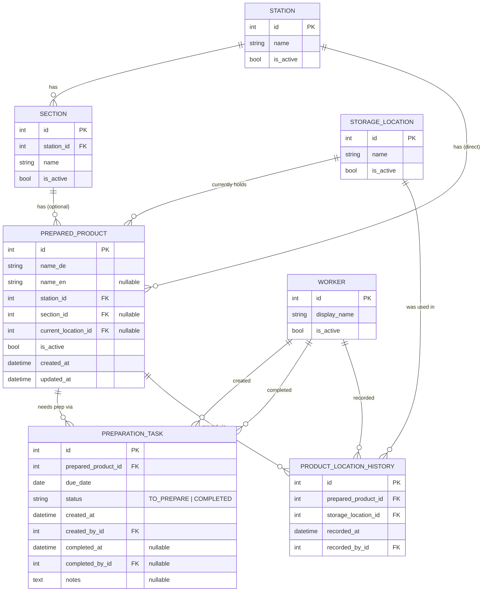

# Kitchen Prep Handover & Location Tracker — MVP Specification

This is a **separate, smaller project** from the long-term Restaurant Preparation
Intelligence System described in `docs/architecture.md`, `docs/data-model.md`,
`docs/preparation-engine.md`, and `docs/roadmap.md`. Those documents are the
**future** architecture and are unchanged by this one.

This MVP solves two narrow, real problems *today*, with no forecasting, no
quantities, no AI, and no integrations. Application code lives in a sibling
`kitchen-handover/` directory at the repo root, kept separate from the paths
the long-term architecture already reserves (`backend/app/`, `data/`, `scripts/`).

---

## 1. Business context

Initial restaurant: **Das Humbser** (traditional German restaurant).

Stations:

```text
PASS
├── DIPS
├── SALAT
└── SCHWEIN

GRILL
FRITTEUSE
DESSERT
```

`PASS` has sub-sections; the other stations currently don't, but the schema
must not assume that's permanent. All station/section/product names are
**placeholders** — they must be editable from data, never hardcoded into
application logic, because the kitchen will verify and likely change them.

Storage locations currently include: `Kühlhaus 1`, `Kühlhaus 2`, `Kühlschrank 1`,
`Kühlschrank 2`, `Kühlschrank 3` — also editable, more will be added later.

Everything tracked here is a **prepared product / mise-en-place item**
(Krautsalat, Remoulade, Schweinesauce, …) — **never a raw ingredient**.

## 2. The two problems

**Problem 1 — bad handover.** A worker notices a prepared product is finished
or nearly finished, but forgets to tell tomorrow's worker. It's discovered
missing during service, causing a rushed, stressful emergency prep.

**Problem 2 — lost products.** A worker moves a prepared product to a
different fridge/Kühlhaus. The next worker doesn't know where it ended up and
has to search every location or ask around.

## 3. What the MVP answers — nothing more

1. What do I need to prepare today?
2. Where is a particular prepared product?
3. Which items did someone mark for tomorrow?
4. Where did someone last store/move an item?

## 4. Core workflows

**Mark for tomorrow:** Station → (Section) → Product → **"Für morgen
vorbereiten"** (Prepare tomorrow). Creates a `PreparationTask` due tomorrow.
Pressing it again for the same product/due-date does not create a duplicate —
it returns "already marked."

**Next-day view:** opening a station immediately shows **today's
preparation** — everything due today or earlier, overdue first. Tapping
**DONE** completes the task; it leaves the active list but stays in history
forever (never deleted).

**Overdue, never silently dropped:** an uncompleted task whose due date has
passed renders as **OVERDUE** instead of disappearing. `OVERDUE` is *derived*
(`due_date < today AND status != COMPLETED`), never stored as its own status.

**Location:** a product detail screen shows its current storage location,
when it was last updated, and by whom. **"Standort ändern"** (change
location) updates the current location and appends to a location history in
one transaction — both happen, or neither does.

**Search:** typing a product name returns it immediately with its station,
section, current location, and preparation status (`AVAILABLE` /
`TO_PREPARE` / derived `OVERDUE`).

## 5. Explicit non-goals for this MVP

No quantities, units, or container sizes (kg/L/box sizes — that's the
long-term system, Phase 1+). No forecasting, historical analysis,
reservations, POS/E2N integration, AI demand prediction, priority scoring,
raw ingredients, recipes, waste analysis, or voice input. No real
authentication (a worker just picks/types their name). No native mobile app
(responsive web now, PWA-ready later). No complex warehouse/inventory
tracking — just "current location + a simple history."

## 6. Data model



### Resolved ambiguities (decided here, flagged for correction if wrong)

- **`PreparedProduct` naming**: the original sketch listed `name`,
  `name_de`, *and* `name_en` — redundant. This spec uses only `name_de`
  (required) + `name_en` (nullable, filled in later), matching §29's
  bilingual-ready intent without a meaningless third field. `Station`/
  `Section` names (`PASS`, `DIPS`, …) stay single-language — they're short
  kitchen codes already used identically in German and English, not prose.
- **Duplicate-task prevention scope**: a DB-level partial unique index on
  `(prepared_product_id, due_date)` where `status = 'TO_PREPARE'` — matching
  the spec's literal wording ("same product **and due date**"), not a
  broader "one active task per product ever" rule. An overdue task and a
  freshly created tomorrow-task for the same product can coexist; both
  simply show up (overdue one today, the new one tomorrow).
- **"MARK PREPARED" (product screen) vs. "DONE" (station list)**: treated as
  the same action — completing that product's current active task — just
  triggerable from two screens.
- **Section ↔ Station integrity**: enforced in the service layer (a product's
  `section_id`, if set, must belong to its own `station_id`), not a DB
  constraint SQLite can express directly — same pattern used throughout the
  long-term docs ("enforced in a service, not the schema").
- **App location in this repo**: a new sibling `kitchen-handover/` directory
  at the repo root (not inside `docs/`, not colliding with the long-term
  system's reserved `backend/app/`, `data/`, `scripts/` paths).

## 7. Folder structure

```text
kitchen-handover/
├── README.md
├── .gitignore
├── .env.example
├── requirements.txt
├── app/
│   ├── main.py
│   ├── core/            # config, enums
│   ├── db/              # engine/session/declarative base
│   ├── models/          # SQLAlchemy ORM models
│   ├── schemas/         # Pydantic request/response models (later)
│   ├── repositories/    # DB access (later)
│   ├── services/        # business logic (later)
│   ├── routes/          # thin FastAPI routers (later)
│   ├── templates/       # Jinja2 + HTMX (later)
│   └── static/          # CSS (later)
├── data/                # stations.csv, sections.csv, prepared_products.csv, storage_locations.csv
├── scripts/             # seed.py (idempotent)
├── tests/
└── alembic/             # migrations
```

## 8. Screens / routes (target shape, not all built yet)

```text
GET  /                                    home: station cards + search
GET  /stations/{id}                       station screen: today's prep + sections
GET  /stations/{id}/tasks/today           today's (incl. overdue) tasks, JSON/partial
GET  /products/{id}                       product detail screen
GET  /products/search?q=                  global search
POST /products/{id}/prepare-tomorrow      create tomorrow's task (dedup'd)
POST /tasks/{id}/complete                 mark a task COMPLETED
POST /products/{id}/location              change current location (+ history, 1 transaction)
GET  /products/{id}/location-history      location history for a product
GET  /workers, POST /workers              worker list / create (no auth)
```

## 9. Technology

Python, FastAPI, SQLAlchemy (2.0 style), Pydantic, SQLite (dev), Alembic,
Jinja2 + HTMX for UI, plain CSS. No React/Next.js. No native mobile — a
responsive web app designed to become an installable PWA later.

## 10. Implementation order

1. **Project skeleton + database models + migration + model tests** ← current step
2. Repositories (thin DB access per aggregate)
3. Services (`PreparationTaskService`, `ProductLocationService`, `ProductService`, `StationService`) with the real business rules: prepare-tomorrow dedup, transactional location change, today's-task query (overdue-first sort)
4. Pydantic schemas + thin FastAPI routes
5. Seed CSVs + idempotent `scripts/seed.py`
6. Jinja2 + HTMX templates (home → station → product, mobile-first)
7. Search
8. i18n dictionary (DE default, EN ready)
9. Integration tests over the real routes
10. PWA manifest / installability pass

Each step stops for review before the next begins.

## 11. Definition of done (MVP)

A worker can, on a phone: browse PASS/GRILL/FRITTEUSE/DESSERT, tap "prepare
tomorrow" on a product in a few taps, have it appear under tomorrow's
worker's "today's preparation" (overdue items never silently vanish), mark it
done, search any product by name and see its current storage location and
who/when last moved it, and change a product's location in 2–3 taps with the
change recorded in history — all without forecasting, AI, recipes, or
external integrations.
